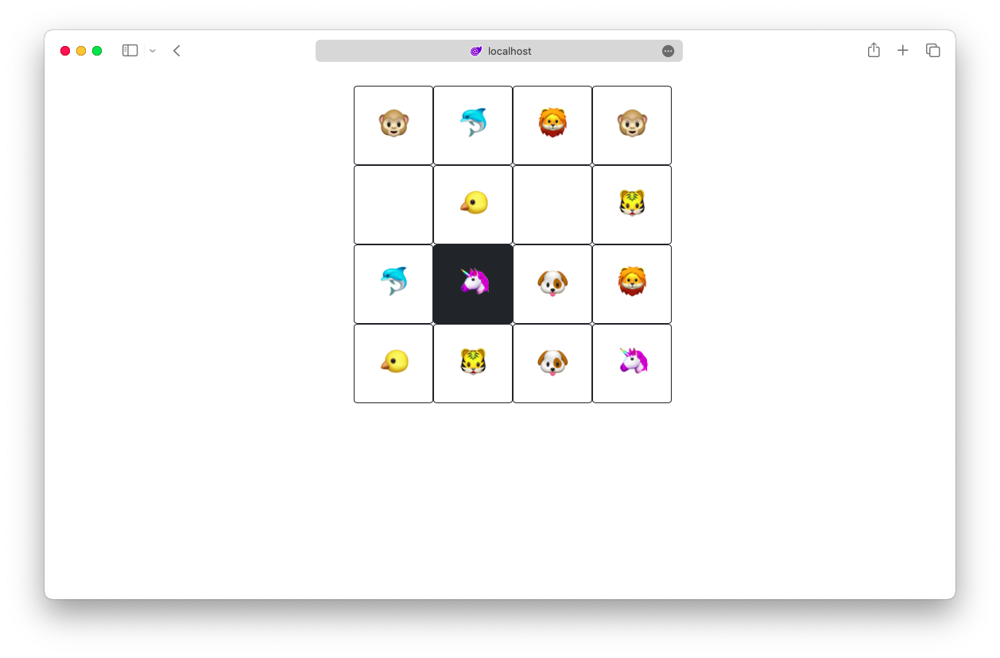

# Match Game

This project is a simple match game. The game is played by clicking on two cards. If the cards match, they will be delete from table.

Purpose of this project is learning C# and .NET.

